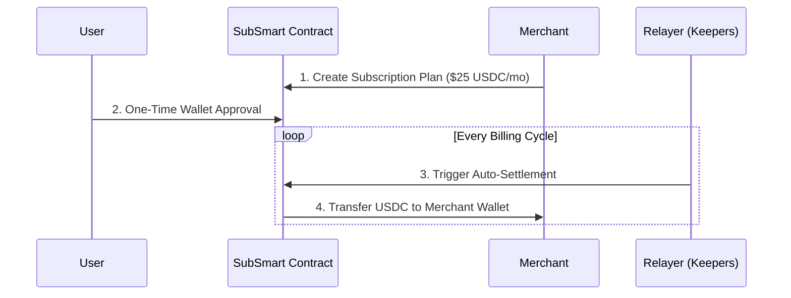

# 🌐 SubSmart Protocol
**Subscriptions Without Trust. The "Stripe for Web3".**


-green?style=for-the-badge)


## 🚀 What is SubSmart?
Web3 SaaS businesses and DAOs face a massive **40% churn rate** because they lack an automated "Subscription" button. Users are forced to manually approve crypto payments every single month, causing massive friction.

**SubSmart** solves this. We are a 100% on-chain, non-custodial smart contract deployed on the Polygon network that enables automated recurring billing in USDC/USDT with **zero chargebacks and low gas fees**.

---

## 📊 System Architecture



## ⚙️ How It Works (3 Simple Steps)
 1. **Merchant Setup:** A merchant connects their Web3 wallet and creates a recurring subscription plan on our dashboard.
 2. **User Approval:** The customer signs a **one-time** smart contract approval via their wallet (MetaMask/Trust Wallet/Phantom).
 3. **Auto-Settlement (The Magic):** We utilize Decentralized Relayers (like Gelato/Chainlink Keepers) to automatically pull funds on the exact billing cycle date. **Zero manual signing required by the user ever again.**

## 🛠 Tech Stack
 * **Smart Contracts:** Solidity (Deployed on Polygon for sub-cent gas fees)
 * **Frontend:** HTML, CSS, JavaScript (Mobile-Responsive Web3 UI)
 * **Payments:** USDC / USDT Integrations
 * **Automation:** Decentralized Relayers for zero-downtime transaction execution

## 🔗 Deployed Contracts (Polygon Testnet)
*Currently in active testing phase.*
 * **SubSmart Factory Contract:** [PASTE_YOUR_CONTRACT_ADDRESS_HERE]
 * **USDC Test Token Address:** [PASTE_USDC_TESTNET_ADDRESS_HERE]
*(Note: Replace the brackets above with your actual contract addresses when deploying)*

## 💻 Developer Setup (Run Locally)
Want to check out the frontend code or run it locally?
```bash
# Clone the repository
git clone [https://github.com/dakshrawat298/SubSmart-Web3.git](https://github.com/dakshrawat298/SubSmart-Web3.git)

# Navigate into the directory
cd SubSmart-Web3

# Open index.html in your browser or run a live server
# (If using Replit, simply hit the "Run" button)
```

## 💰 The Revenue Model
Simple, transparent pricing. We charge a flat **0.5% protocol fee** only on successful recurring transactions. Zero setup fees or monthly limits for merchants.

## 🧠 The Founder's Story
I am **Daksh Rawat**, a 19-year-old BBA student with zero traditional coding background. I built the entire SubSmart Smart Contract and Frontend MVP completely on an iPhone using AI, without even opening a laptop. I am an execution-focused visionary on a mission to bridge the gap between traditional SaaS billing convenience and true Web3 ownership.

## 🤝 Next Steps (The Road to Mainnet)
SubSmart is currently in the active fundraising phase. We are participating in global Web3 Hackathons and applying for ecosystem grants to raise a **$10,000 Micro-Seed round**.

**Where the funds will go:**
 * 🛡️ **40%:** Tier-1 Smart Contract Audits (Security is our absolute priority before handling mainnet funds)
 * ⚖️ **30%:** Legal entity setup & Polygon Mainnet deployment
 * 🚀 **30%:** Go-to-Market (Acquiring our first 10 paying Web3 SaaS merchants and DAOs)

We are actively looking to connect with Web3 operators, angel investors, and ecosystem builders who align with our vision of decentralized, frictionless subscriptions.

**Links:**
 * [🔗 Linktree & Live Video Demos](https://linktr.ee/SubSmartProtocol)
 * [🐦 Follow the Journey on X (Twitter)] (https://x.com/dakshra65292147?s=21)
